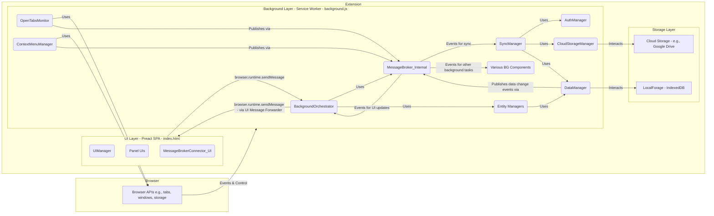
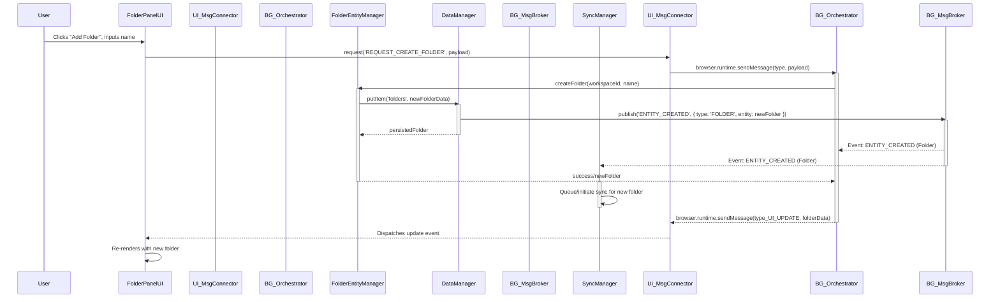

# Technical Specification Document: Tabitha Browser Extension

## 1. Introduction

This Technical Specification Document (TSD) provides a detailed technical blueprint for the development of the "Tabitha" browser extension. It translates the requirements outlined in the Product Requirements Document (PRD v1.0) and the vision from the DesignProposal.md into an actionable plan for the engineering team. This document details the system architecture, component design, data models, technology stack, and key implementation strategies.

The primary audience for this TSD is the development team responsible for implementing the Tabitha browser extension. Tabitha is a free open-source browser extension licensed under GPL 3, with project hosting and support via GitHub.

## 2. Architecture Overview

### 2.1. High-Level Architecture

Tabitha will employ a **Modular Component-Based Architecture** following an **Event-Driven** pattern. This architecture is well-suited for browser extensions, promoting separation of concerns, maintainability, and testability.

*   **Modularity**: The system will be decomposed into distinct modules/components, each with specific responsibilities (e.g., data management, UI rendering, synchronization).
*   **Event-Driven**: Components will communicate primarily through an internal event bus (`MessageBroker_Internal`) within the background service worker or direct asynchronous messaging via `browser.runtime.sendMessage` for inter-context communication (e.g., UI to Background). This is crucial for handling:
    *   User interactions in the UI.
    *   Browser events (tab updates, window changes).
    *   Data synchronization events.
    *   Background tasks.
*   **Client-Side Focus**: All core logic and data processing occur within the user's browser, aligning with PRD Section 1.3 ("Client-Side Operation with Cloud Syncing").

**Architectural Diagram (Conceptual):**



*(Diagram Legend: `InternalMsgBroker` serves as the central hub for event distribution within the background. `DataManager` publishes generic data change events. `SyncManager` and `BackgroundOrchestrator` (for UI forwarding) subscribe to relevant events from this broker.)*

### 2.2. Extension Component Interaction

The extension will utilize standard Manifest V3 components:

1.  **Background Service Worker (`background.ts` / `background.js` after build)**:
    *   **Responsibilities**:
        *   Acts as the central nervous system of the extension.
        *   Manages the core application state and business logic via its constituent manager components (e.g., `DataManager`, `SyncManager`, Entity Managers).
        *   Interfaces with browser APIs for privileged operations (e.g., `browser.tabs`, `browser.windows`, `browser.storage.local`, `browser.identity`, `browser.tabGroups`, `browser.contextMenus`, `browser.alarms`).
        *   Orchestrates online synchronization.
        *   Listens to browser-level events (e.g., extension installation/update, browser startup).
        *   Handles messages from UI pages and other extension contexts.
    *   **Lifecycle & State Management**: Being event-driven, it will activate when needed and can become inactive to conserve resources, as per Manifest V3 behavior.
        *   **Persistent User Data**: Stored via `DataManager` in IndexedDB (wrapped by LocalForage).
        *   **Operational State**: Short-lived operational state (e.g., ongoing sync operation progress, UI interaction states awaiting processing) must be designed to be recoverable or re-derivable. Critical intermediate states for long-running processes (e.g., complex data migrations, multi-step sync phases) should be minimized. If unavoidable, they may need to be temporarily persisted to `browser.storage.session` or `browser.storage.local` and reconciled upon Service Worker restart. Non-critical state will be re-derived. Global application settings are persisted via `SettingsManager`.
        *   `browser.alarms` API will be used for tasks that need to run periodically or at specific times, ensuring they execute even if the service worker was inactive.

2.  **UI Pages (New Tab Takeover / Dedicated Tab - `index.html`, `main.tsx` / `main.js` after build)**:
    *   **Responsibilities**:
        *   Render the four-panel user interface and Tabitha Hub (Welcome, Help, Settings) using Preact.
        *   Handle all direct user interactions (clicks, drag-and-drop, keyboard input).
        *   Send commands/requests for data or actions to the Background Service Worker via its `MessageBrokerConnector_UI`.
        *   Subscribe to data updates from the Background Service Worker (relayed from the internal `MessageBroker_Internal` via the `BackgroundOrchestrator`) to dynamically refresh the UI.
        *   Operate as a Single Page Application (SPA).
    *   **Instantiation**: Multiple instances can exist if the user has Tabitha open in several tabs. Each instance maintains its own UI state but reflects the shared data managed by the Background Service Worker.

3.  **Content Scripts**:
    *   **Not currently required** for the core functionality as described in the PRD. Features like browser context menu integration are managed by the background script. If future features require direct interaction with web page content (e.g., a page clipper), content scripts would be introduced then, following standard isolation and communication patterns with the background script.

4.  **Communication Flow**:
    *   **UI to Background**: UI pages will use `browser.runtime.sendMessage()` (abstracted by `MessageBrokerConnector_UI`) to send messages (commands, data requests) to the Background Service Worker. Messages will be structured objects with a `type` (string identifier) and `payload` (data object).
    *   **Background to UI**: The `BackgroundOrchestrator` in the Service Worker listens for relevant events from the internal `MessageBroker_Internal`. Upon receiving an event intended for the UI, it uses `browser.runtime.sendMessage()` to broadcast to all relevant Tabitha UI tab instances. UI pages will have listeners using `browser.runtime.onMessage.addListener()` (managed by `MessageBrokerConnector_UI`).
    *   **Example Interaction (User creates a new Folder)**:
        1.  User clicks "Add Folder" in UI.
        2.  UI's `FolderPanelUIManager` captures input, calls its internal logic (e.g., `handleCreateFolder(workspaceId, folderName)`).
        3.  This UI logic sends message via `MessageBrokerConnector_UI.request('REQUEST_CREATE_FOLDER', { workspaceId, name })`.
        4.  Background SW's `BackgroundOrchestrator` receives the message via `browser.runtime.onMessage`, validates it, and routes to `FolderEntityManager.createFolder(workspaceId, name)`.
        5.  `FolderEntityManager` interacts with `DataManager` to persist the new folder.
        6.  `DataManager` saves to LocalForage and publishes an internal event (e.g., `{ topic: 'ENTITY_CREATED', data: { type: 'FOLDER', entity: newFolder } }`) using `MessageBroker_Internal`.
        7.  The `BackgroundOrchestrator` (or a dedicated UI forwarding module within it) subscribes to `ENTITY_CREATED` (and similar topics) on `MessageBroker_Internal`. Upon receiving the event, it formats a message and uses `browser.runtime.sendMessage()` to broadcast to all active Tabitha UI instances.
        8.  The `SyncManager` also subscribes to `ENTITY_CREATED` (and similar topics) on `MessageBroker_Internal`. Upon receiving the event, it schedules or triggers its synchronization logic for the changed entity.
        9.  Each UI instance's `MessageBrokerConnector_UI` receives the broadcast from the `BackgroundOrchestrator`. Relevant UI components (e.g., `FolderPanelUI`) subscribed to this event type update their displays.

**Sequence Diagram for "User creates a new Folder":**


### 2.3. Cross-Browser Compatibility Strategy

As per PRD Section 3.1, compatibility with Chrome, Firefox, Edge, and Opera is required.

1.  **`webextension-polyfill`**: This library (by Mozilla) will be used to write extension code against a promise-based `browser.*` API, which the polyfill maps to `chrome.*` or other native APIs. This significantly reduces browser-specific conditional code.
2.  **Manifest V3**: The extension will be developed primarily targeting Manifest V3.
    *   **Chrome, Edge, Opera**: Natively support Manifest V3.
    *   **Firefox**: Has robust Manifest V3 support using Service Workers. The polyfill will handle most API differences. Thorough testing on Firefox is essential to catch any subtle behavioral variations.
3.  **Feature Detection & Graceful Degradation**:
    *   For browser-specific features like Chrome Tab Groups (`browser.tabGroups` API), the system will check for the API's existence (e.g., `if (browser.tabGroups && browser.tabGroups.query)`).
    *   If the API is unavailable, related UI elements and functionalities will be hidden or disabled, as specified in the PRD (e.g., Section 2.1 "Save Group as Collection" is Chrome-only if integration active; Section 6.6.3 "Enable Chrome Tab Group Integration" setting).
4.  **CSS**: Use standard CSS properties. Vendor prefixes will be managed by a build tool like PostCSS with Autoprefixer. Flexbox and Grid will be used for layout.
5.  **Testing**: Rigorous manual and automated testing will be performed on the latest stable versions of all targeted browsers and major operating systems (Windows, Linux) throughout the development lifecycle.

### 2.4. Manifest File (`manifest.json`) Key Details

*   `manifest_version`: 3
*   `name`: "Tabitha"
*   `version`: (Semantic Versioning, e.g., "0.0.1")
*   `description`: (As per PRD, synchronized with `package.json`)
*   `permissions`:
    *   `storage`: For `browser.storage.local`, `browser.storage.session`, and IndexedDB access (implicitly covered).
    *   `identity`: For OAuth authentication.
    *   `tabs`: To manage and query browser tabs.
    *   `windows`: To manage and query browser windows.
    *   `contextMenus`: For adding items to the browser context menu.
    *   `alarms`: For scheduling periodic tasks.
*   `optional_permissions`:
    *   `tabGroups`: (Chrome specific) For Tab Group integration. This permission will be requested at runtime using `browser.permissions.request()` when the user enables the feature.
*   `host_permissions`:
    *   Initially none. If cloud providers other than Google Drive AppData (which doesn't need host permissions for its API via `fetch` with token) are added, specific API endpoint URLs might be needed here, or they can be included in `optional_host_permissions`.
*   `background`:
    *   `service_worker`: "background.ts" (Source file; Vite bundles it, typically to `background.js` or similar name based on build config)
    *   `type`: "module" (Used for ES modules in the service worker, common with Vite builds)
*   `action`:
    *   `default_title`: "Open Tabitha"
    *   `default_icon`: { "16": "assets/icon16.png", "32": "assets/icon32.png", "48": "assets/icon48.png", "128": "assets/icon128.png" }
    *   *(No `default_popup` if clicking the icon opens the main Tabitha UI tab. The `browser.action.onClicked` listener in the background script will handle opening the tab.)*
*   `icons`: Standard set of extension icons.
    *   Example: { "16": "assets/icon16.png", "32": "assets/icon32.png", "48": "assets/icon48.png", "128": "assets/icon128.png" }
*   `chrome_url_overrides`:
    *   `newtab`: "index.html" (If New Tab Takeover mode is enabled by default or set by user).
*   `options_ui`:
    *   `page`: "index.html#/settings" (Reusing the main SPA for settings).
    *   `open_in_tab`: true (Recommended for complex settings pages).
*   `content_security_policy`:
    *   `extension_pages`: "script-src 'self'; style-src 'self'; object-src 'self';"
        *   **Note on `style-src 'unsafe-inline'`**: The use of `'unsafe-inline'` for `style-src` should be strictly avoided if possible. For dynamic styling (e.g., theming from Tiptap or custom themes), prefer CSP-compatible methods such as updating CSS Custom Properties via JavaScript, or using pre-defined stylesheets that can be toggled. If a third-party library absolutely requires inline styles and no alternative exists, this risk must be carefully evaluated. An investigation into ensuring all styling methods are CSP-compliant without `'unsafe-inline'` is a priority.
*   `web_accessible_resources`:
    *   Initially, this might be minimal. If any resources like icons or specific JS/CSS files need to be accessible from web pages or content scripts, they must be declared here.
    *   Example for icons if they need to be loaded by web pages directly (unlikely for Tabitha's core):
        `[ { "resources": ["assets/icon16.png", "assets/icon32.png"], "matches": ["<all_urls>"] } ]`
    *   The current `manifest.json` correctly includes assets used by the extension itself, with an empty `matches` array if they aren't meant for web page access.

## 3. Component Breakdown

The system will be composed of several key components/modules, typically implemented as TypeScript classes or collections of functions, organized by layer.

### 3.1. Background Components (Primarily within Service Worker `background.ts` context)

1.  **`BackgroundOrchestrator`**
    *   **Responsibilities**: Initializes and coordinates all background managers/services. Manages the service worker lifecycle events (`runtime.onInstalled`, `runtime.onStartup`). Entry point for messages from UI pages (`runtime.onMessage`). Sets up alarms. Subscribes to relevant events from `MessageBroker_Internal` and forwards them to UI pages.
    *   **Key Methods**: `initialize(): void`, `handleUIMessage(message: any, sender: browser.runtime.MessageSender, sendResponse: (response?: any) => void): boolean | undefined`, `forwardEventToUI(topic: string, data: any): void`
    *   **Interactions**: Other Background Managers, `MessageBroker_Internal`, Browser APIs.

2.  **`DataManager`**
    *   **Responsibilities**: Centralized data access layer. Handles all CRUD operations for all data entities using LocalForage (IndexedDB wrapper). Ensures data integrity and consistency for local storage. Publishes data change events (e.g., `ENTITY_CREATED`, `ENTITY_UPDATED`, `ENTITY_DELETED`) to `MessageBroker_Internal`. Manages IndexedDB schema and migrations.
    *   **Key API (Illustrative, using TypeScript types)**:
        *   `async getItem<T>(storeName: string, id: string): Promise<T | null>`
        *   `async getAllItems<T>(storeName: string, indexName?: string, indexValue?: any): Promise<T[]>`
        *   `async putItem<T extends {id: string, lastModifiedAt: string}>(storeName: string, item: Omit<T, 'lastModifiedAt'> & Partial<Pick<T, 'lastModifiedAt'>>): Promise<T>` (auto-updates `lastModifiedAt`, handles create/update)
        *   `async deleteItem(storeName: string, id: string): Promise<void>` (For hard deletes; soft deletes managed by entity managers using `isDeleted` flags)
        *   `async markAsDeleted(storeName: string, id: string): Promise<void>` (updates entity with `isDeleted=true`, `deletedAt=now()`)
        *   `async getWorkspaceDeep(workspaceId: string): Promise<WorkspaceWithDetails | null>` (loads workspace and its nested entities, excluding soft-deleted ones unless specified)
        *   `async saveUserSettings(settings: UserSettings): Promise<void>`
        *   `async getUserSettings(): Promise<UserSettings | null>`
    *   **Interactions**: LocalForage API, Entity Managers, `MessageBroker_Internal`.

3.  **`SyncManager`**
    *   **Responsibilities**: Manages online data synchronization. Orchestrates authentication flow (via `AuthManager`), data serialization/deserialization, communication with `CloudStorageManager`, conflict resolution logic (entity-level LWW merge), and sync scheduling/throttling. Subscribes to data change events from `MessageBroker_Internal` to trigger sync operations.
    *   **Key Methods**:
        *   `async initiateSync(force?: boolean, workspaceId?: string): Promise<void>` (workspaceId for targeted sync if applicable)
        *   `async setCloudProvider(provider: string): Promise<void>`
        *   `_handleDataChangeEvent(event: { topic: string, data: { type: string, entityId: string, workspaceId?: string, changeType: 'CREATED' | 'UPDATED' | 'DELETED' } }): Promise<void>` (internal method, triggered by broker subscription)
        *   `getSyncStatus(): SyncStatusInfo`
    *   **Interactions**: `AuthManager`, `CloudStorageManager`, `DataManager` (for reading local state), `MessageBroker_Internal`, `browser.alarms`.

4.  **`AuthManager`**
    *   **Responsibilities**: Handles OAuth 2.0 authentication with cloud providers. Manages token acquisition, caching (securely, considering SW lifecycle), refresh, and revocation.
    *   **Key Methods**:
        *   `async getAccessToken(provider: string, interactive: boolean): Promise<string | null>`
        *   `async revokeToken(provider: string): Promise<void>`
        *   `async ensureAuthenticated(provider: string, interactive: boolean): Promise<boolean>`
    *   **Interactions**: `browser.identity`, `SyncManager`.

5.  **`CloudStorageManager`**
    *   **Responsibilities**: Abstracts interactions with specific cloud storage provider APIs (e.g., Google Drive API). Handles file/folder operations in the cloud (list, download, upload, delete). Implements provider-specific logic, adheres to a generic interface.
    *   **Key Methods (Interface)**:
        *   `async listFiles(folderPath?: string): Promise<FileInfo[]>`
        *   `async downloadFile(fileId: string): Promise<any>` (parsed JSON or string)
        *   `async uploadFile(filePath: string, data: any, metadata?: object): Promise<FileInfo>`
        *   `async deleteFile(fileId: string): Promise<void>`
        *   `async getFileInfo(fileId: string): Promise<FileInfo | null>`
    *   **Interactions**: `SyncManager`, `fetch` API (or provider SDKs).

6.  **`OpenTabsMonitor`**
    *   **Responsibilities**: Monitors browser tab, window, and (for Chrome) tab group events. Fetches current state and broadcasts updates (e.g., `OPEN_TABS_VIEW_UPDATED`) to interested background components via `MessageBroker_Internal`.
    *   **Key Methods**:
        *   `async getCurrentOpenTabsState(): Promise<OpenTabsViewData>`
        *   `startMonitoring(): void`
        *   `stopMonitoring(): void`
    *   **Interactions**: `browser.tabs`, `browser.windows`, `browser.tabGroups` APIs, `MessageBroker_Internal`.

7.  **`ContextMenuManager`**
    *   **Responsibilities**: Manages browser context menu items creation, updates, and click handling.
    *   **Key Methods**: `setupContextMenus(): void`, `handleContextMenuClick(info: browser.contextMenus.OnClickData, tab?: browser.tabs.Tab): void`
    *   **Interactions**: `browser.contextMenus` API, `MessageBroker_Internal` (to dispatch actions to core logic like `CollectionEntityManager`).

### 3.2. UI Components (Logic within UI page context, e.g., `main.tsx` and Preact components)

1.  **`UIManager`** (Main application component in Preact, e.g., `App.tsx` in `main.tsx`)
    *   **Responsibilities**: Top-level UI controller. Manages overall layout (panels, Tabitha Hub). Orchestrates rendering of different views. Handles global UI states (e.g., active workspace, theme), likely using Preact Context and/or `@preact/signals`. Initializes `MessageBrokerConnector_UI`.
    *   **Key Methods (Conceptual, implemented via Preact components and state)**:
        *   `initializeUI(initialData: AppState): void`
        *   `renderAppLayout(): preact.VNode`
        *   `navigateTo(route: string, params?: object): void` (using a simple client-side router like `preact-iso` or state changes)
    *   **Interactions**: Panel-specific UI components, `MessageBrokerConnector_UI`, `SettingsUIManager`, `NotificationUIManager`.

2.  **Panel UIs (e.g., `WorkspacePanelUI`, `FolderPanelUI`, `CollectionPanelUI`, `OpenTabsPanelUI`)**
    *   **Responsibilities**: Manages rendering and interactions for its specific panel. Displays data, handles sorting, filtering (for Collections), drag-and-drop. Communicates user actions to the background script via `MessageBrokerConnector_UI`.
    *   **Key Logic (Example for `CollectionPanelUI`)**:
        *   Renders list of collections based on data received from background.
        *   Handles collection selection, creation, renaming, deletion requests by sending messages.
        *   Manages drag-and-drop of items into/out of collections, triggering appropriate messages.
    *   **Interactions**: Preact rendering, UI state, `MessageBrokerConnector_UI`.

3.  **`TabithaHubUIManager`**
    *   **Responsibilities**: Manages the Tabitha Hub interface (Welcome/Onboarding, Help, Settings tabs).
    *   **Key Logic**: Switches views within the Hub, renders content for each section.
    *   **Interactions**: Preact rendering, `SettingsUIManager` (for settings view), `MessageBrokerConnector_UI`.

4.  **`NotificationUIManager`**
    *   **Responsibilities**: Displays user notifications (toasts, popovers, alerts) using a library like Tippy.js or custom Preact components.
    *   **Key Methods**:
        *   `showToast(message: string, type: 'info' | 'success' | 'warning' | 'error', duration?: number): void`
        *   `showConfirmation(config: ConfirmationConfig): Promise<boolean>`
    *   **Interactions**: UI rendering library, listens to notification events relayed by `MessageBrokerConnector_UI`.

5.  **`MessageBrokerConnector_UI`** (UI-side helper for communication with Background SW)
    *   **Responsibilities**: Manages communication with the background service worker. Wraps `browser.runtime.sendMessage` for sending requests and `browser.runtime.onMessage.addListener` for receiving updates. Provides a typed and simplified API for UI components to interact with the background.
    *   **Key API (Illustrative, using TypeScript types)**:
        *   `async request<P = any, R = any>(type: string, payload?: P): Promise<R>`
        *   `subscribe(eventType: string, callback: (payload: any) => void): () => void` (returns an unsubscribe function)
        *   `unsubscribe(eventType: string, callback: (payload: any) => void): void`
    *   **Interactions**: `browser.runtime` API, All UI components that need to communicate with background or receive updates.

### 3.3. Core Logic / Manager Components (Instantiated in Background, can be pure logic usable elsewhere if applicable)

1.  **`MessageBroker_Internal`** (Internal Event Bus in Background SW)
    *   **Responsibilities**: Facilitates decoupled, asynchronous communication between background components using a pub/sub model. Does NOT directly communicate with UI pages; the `BackgroundOrchestrator` subscribes to this broker and forwards relevant events to the UI.
    *   **Key API (Illustrative, using TypeScript types)**:
        *   `publish(topic: string, data: any): void`
        *   `subscribe(topic: string, callback: (data: any) => void | Promise<void>): () => void` (returns an unsubscribe function)
    *   **Interactions**: Used by most background components to signal events or data changes internally.

2.  **`SettingsManager`**
    *   **Responsibilities**: Manages retrieval and persistence of user settings, custom themes, and custom TXT templates. Handles settings schema migration.
    *   **Key API**: (Defined with TypeScript interfaces for `UserSettings`, `ThemeDefinition`, etc.)
        *   `async getSetting<K extends keyof UserSettings>(key: K): Promise<UserSettings[K]>`
        *   `async setSetting<K extends keyof UserSettings>(key: K, value: UserSettings[K]): Promise<void>`
        *   `async getAllSettings(): Promise<UserSettings>`
        *   (Specific getters/setters for themes, templates, typed appropriately)
    *   **Interactions**: `DataManager` (for persistence), `ThemeManager`, `MessageBroker_Internal` (to announce settings changes).

3.  **`ThemeManager`**
    *   **Responsibilities**: Handles theme logic: applying themes (generates CSS variables for UI to consume), managing predefined themes, generating custom theme palettes.
    *   **Key API**:
        *   `async generateThemeCSSProperties(theme: ThemeDefinition, displayMode: 'light' | 'dark'): Promise<Record<string, string>>` (UI will apply these CSS custom properties)
        *   `async generateThemePalette(seedColor: string): Promise<{ light: ColorPalette, dark: ColorPalette }>`
        *   `async getEffectiveThemeColors(workspaceId?: string): Promise<ColorPalette>` (Workspace specific or global theme)
    *   **Interactions**: `SettingsManager`, `DataManager`, Material Color Utilities library.

4.  **`TagManager`**
    *   **Responsibilities**: Manages CRUD operations for tags (`TagDefinition`). Handles assigning tags to entities (e.g., Collections, Items) and retrieving entities by tags. Ensures tag consistency (e.g., unique tag names/IDs).
    *   **Key API (Illustrative)**:
        *   `async createTag(name: string, color?: string): Promise<TagDefinition>`
        *   `async getTag(id: string): Promise<TagDefinition | null>`
        *   `async getAllTags(): Promise<TagDefinition[]>`
        *   `async updateTag(id: string, updates: Partial<TagDefinition>): Promise<TagDefinition>`
        *   `async deleteTag(id: string): Promise<void>` (may involve removing tag from all associated entities)
        *   `async getEntitiesByTag(tagId: string, entityType?: string): Promise<any[]>`
    *   **Interactions**: `DataManager`, `MessageBroker_Internal`.

5.  **`SearchManager`**
    *   **Responsibilities**: Provides full-text search capabilities across all relevant user data (Workspaces, Folders, Collections, Items - titles, content, URLs, tags). Manages indexing of data for efficient searching using Fuse.js.
    *   **Key API (Illustrative)**:
        *   `async search(query: string, options?: SearchOptions): Promise<SearchResultItem[]>`
        *   `async indexData(entities: any[]): Promise<void>` (called when data changes significantly)
        *   `async _onDataChanged(event: DataChangeEvent): Promise<void>` (subscribes to internal broker to update index incrementally if possible)
    *   **Interactions**: `DataManager` (to fetch data for indexing/searching), Fuse.js, `MessageBroker_Internal`.

6.  **`RecycleBinManager`**
    *   **Responsibilities**: Manages soft-deleted entities. Provides functionality to list items in the recycle bin, restore them, or permanently delete them. Relies on entities being marked with `isDeleted` and `deletedAt` flags by entity managers/`DataManager`.
    *   **Key API (Illustrative)**:
        *   `async getRecycledItems(options?: { workspaceId?: string }): Promise<RecycleBinEntry[]>`
        *   `async restoreItem(itemId: string, entityType: string): Promise<void>` (sets `isDeleted=false` on the item)
        *   `async permanentlyDeleteItem(itemId: string, entityType: string): Promise<void>` (hard delete from `DataManager`)
        *   `async emptyRecycleBin(workspaceId?: string): Promise<void>`
    *   **Interactions**: `DataManager`, Entity Managers, `MessageBroker_Internal`.

7.  **`ImportExportManager`**
    *   **Responsibilities**: Handles importing data from various formats (e.g., JSON backup, HTML bookmarks) and exporting Tabitha data (e.g., full JSON backup, specific workspaces/collections).
    *   **Key API (Illustrative)**:
        *   `async exportData(options: ExportOptions): Promise<Blob>` (e.g., export all data, or specific workspace)
        *   `async importData(file: File, options: ImportOptions): Promise<ImportResult>`
    *   **Interactions**: `DataManager`, Entity Managers, `SettingsManager`.

8.  **`KeyboardShortcutManager`**
    *   **Responsibilities**: Manages registration and handling of global keyboard shortcuts defined by the user or application defaults. Communicates actions to relevant UI or Background components.
    *   **Key API (Illustrative)**:
        *   `initializeShortcuts(): void` (reads from settings and registers listeners)
        *   `handleShortcut(command: string): void` (dispatches action, possibly via `MessageBroker_Internal` or `BackgroundOrchestrator` for UI actions)
    *   **Interactions**: `browser.commands` API (for manifest-defined shortcuts), `SettingsManager`, `MessageBroker_Internal`, `BackgroundOrchestrator`.

9.  **`WorkspaceEntityManager`, `FolderEntityManager`, `CollectionEntityManager`, `ItemEntityManager`** (Specific Data Entity Managers)
    *   **Responsibilities**: Encapsulate business logic for their respective entities (CRUD operations, validation, entity-specific rules like handling soft deletes, complex queries), building upon `DataManager`. They are responsible for setting `isDeleted` and `deletedAt` for soft-delete operations.
    *   **Key API (Example for `CollectionEntityManager`, TypeScript types implied by context)**:
        *   `async createCollection(folderId: string, name: string, items?: ItemInput[]): Promise<Collection>`
        *   `async getCollectionWithDetails(collectionId: string): Promise<CollectionWithItems | null>` (filters out soft-deleted items by default)
        *   `async addItemsToCollection(collectionId: string, items: ItemInput[]): Promise<void>` (handles duplicates based on settings)
        *   `async reorderItemsInCollection(collectionId: string, orderedItemIds: string[]): Promise<void>`
        *   `async openAllLinksInCollection(collectionId: string, newWindow: boolean): Promise<void>`
        *   `async deleteCollection(collectionId: string, permanent: boolean = false): Promise<void>` (soft delete by default, updates `isDeleted`, `deletedAt`)
    *   **Interactions**: `DataManager`, `TagManager`, `MessageBroker_Internal`, `browser.tabs` (for opening links).

## 4. Data Models

All data will be stored locally in IndexedDB using LocalForage. Data synced to the cloud will be in JSON format. Unique IDs will be generated using a UUID v4 library (e.g., `uuid` npm package). Timestamps are in ISO 8601 format (UTC, e.g., `YYYY-MM-DDTHH:mm:ss.sssZ`). All data structures will be formally defined using TypeScript interfaces.

*   **Primary Keys**: All `id` fields are primary keys, UUID v4 strings.
*   **Foreign Keys**: Clearly denote relationships (e.g., `workspaceId` in `Folder` links to `Workspace.id`).
*   **Indexes**: `DataManager` will configure LocalForage/IndexedDB with indexes on frequently queried fields like `workspaceId`, `folderId`, `collectionId`, `type`, `tags`, `lastModifiedAt`, `isDeleted` for performance.
*   **`UserSettings.schemaVersion`**: Semantic version string (e.g., "1.0.0") for managing updates to the settings structure.
*   **`appDataSchemaVersion`**: A global schema version for main data entities, stored within `UserSettings` or a dedicated `app_metadata` store. Used for data migrations.
*   **Data Storage Strategy in IndexedDB**:
    *   Separate object stores for each primary entity type (e.g., `workspaces`, `folders`, `collections`, `items`, `tags`, `usersettings`). Soft-deleted items remain in their primary stores, filtered by `isDeleted` flag. The `recyclebin` store is not needed if `isDeleted` is used per entity.
    *   The `items` store will hold all item types (`SavedLinkItem`, `NoteItem`) distinguished by a `type` field.
    *   `UserSettings` will be a single object in its own store (e.g., `app_settings_store` with a known key like `currentUserSettings`).

**Base Entity Interface (for entities that support soft delete and sync)**
```typescript
interface SyncableEntity {
  id: string; // PK, UUID v4
  workspaceId: string; // Denormalized FK to Workspace, Indexed
  createdAt: string; // ISO 8601 UTC
  lastModifiedAt: string; // ISO 8601 UTC, Indexed. Crucial for sync conflict resolution.
  isDeleted: boolean; // For soft delete, Indexed
  deletedAt?: string | null; // ISO 8601 UTC, timestamp of soft deletion
  // Any other common fields for sync metadata if needed
}
```

**TypeScript Interface Example: `Collection` model (extending `SyncableEntity`)**
```typescript
interface Collection extends SyncableEntity {
  folderId: string; // FK to Folder, Indexed
  name: string;
  description?: string;
  icon?: string; // Emoji or icon identifier
  color?: string; // Hex color code for visual distinction
  tags: string[]; // Array of TagDefinition IDs, Indexed
  isPinned: boolean;
  isStarred: boolean;
  itemSortOrder: 'CUSTOM' | 'ALPHANUMERIC_ASC' | 'ALPHANUMERIC_DESC' | 'DATE_CREATED_ASC' | 'DATE_CREATED_DESC' | 'DATE_MODIFIED_ASC' | 'DATE_MODIFIED_DESC';
  itemOrder: string[]; // Array of Item IDs, defines order ONLY if itemSortOrder is "CUSTOM"
  metadata?: Record<string, any>; // For custom fields or future extensions
}

interface CollectionWithItems extends Collection {
  items: Array<SavedLinkItem | NoteItem>; // Or a generic ItemBase, filtered for !isDeleted
}

interface ItemBase extends SyncableEntity {
  collectionId: string; // FK to Collection, Indexed
  type: 'SAVED_LINK' | 'NOTE';
}

interface SavedLinkItem extends ItemBase {
  type: 'SAVED_LINK';
  url: string;
  title?: string;
  favicon?: string;
  // ... other link-specific fields
}

interface NoteItem extends ItemBase {
  type: 'NOTE';
  title?: string;
  content: string; // HTML content from Tiptap, to be sanitized by DOMPurify before rendering
  // ... other note-specific fields
}

// Other models (Workspace, Folder, TagDefinition, UserSettings)
// will be similarly defined with TypeScript interfaces. Workspace, Folder also extend SyncableEntity.
// UserSettings might have its own base or direct fields.
```

## 5. Technology Stack & Key Libraries

Developers should refer to the official documentation for these technologies and libraries. A curated list of key documentation resources and version considerations can be found in Appendix A: Key Technology & Library Documentation.

### 5.1. Core Technologies
*   **Language**: TypeScript (transpiled to JavaScript ESNext, then to target ES version by build tool), HTML5, CSS3
*   **Extension Manifest**: Manifest V3

### 5.2. UI Framework
*   **Preact (v10+) with `preact/hooks` and `preact/compat`**: For building the user interface.
    *   **State Management**: Preact's built-in Context API for global UI state, `useState`/`useReducer` for local component state. Consider using `@preact/signals` for more complex or performant reactive state management if deemed beneficial as development progresses.
    *   **Styling**: CSS Modules (recommended with Vite for scoped styles) or standard CSS with BEM-like conventions, processed by PostCSS. Prefer CSS Custom Properties for dynamic theming.
    *   **Routing**: `preact-iso` or a similar lightweight router for SPA navigation (e.g., to `/settings`).

### 5.3. Key Libraries
*   **`webextension-polyfill`**: Cross-browser compatibility (`browser.*` API).
*   **Font Awesome (Free)**: UI icons (subsetted, bundled, possibly as SVG components).
*   **Interact.js**: Drag-and-drop functionality.
*   **LocalForage**: IndexedDB abstraction.
*   **Fuse.js**: Client-side fuzzy search.
*   **Tippy.js**: Tooltips and popovers (ensure CSP compatibility).
*   **`hotkeys-js`** (or Mousetrap): Keyboard shortcuts. (Current `package.json` includes `hotkeys-js`)
*   **Tiptap (v2)**: WYSIWYG editor for Notes. Requires careful CSP configuration (prioritize avoiding `unsafe-inline` for styles).
*   **DOMPurify**: HTML sanitization for Tiptap output and any other user-generated HTML.
*   **`@material/material-color-utilities`** (or `colord`): Custom theme palette generation. (Current `package.json` includes `@material/material-color-utilities`)
*   **`uuid`**: UUID v4 generation.
*   **`date-fns`**: Robust date/time manipulation and formatting.
*   **`@preact/signals`**: (Present in `package.json`) For reactive state management. Its specific role and integration level should be further defined if it's to be a primary state management solution alongside or in place of Context API/hooks for certain parts of the application.

### 5.4. Build Tools & Code Quality
*   **Build Tool**: Vite (recommended for speed, TypeScript, and Preact support).
    *   Includes transpilation (ESBuild via Vite), bundling, minification, tree-shaking.
*   **CSS Preprocessing**: PostCSS (Autoprefixer, CSS Modules plugin).
*   **Linting**: ESLint (with TypeScript ESLint plugin, Preact/JSX, accessibility, best practices).
*   **Formatting**: Prettier (integrated with ESLint).
*   **Type Checking**: TypeScript compiler (`tsc --noEmit`).
*   **Version Control**: Git, hosted on GitHub.
*   **Documentation**: TSDoc for inline code documentation.
*   **Test Code Management**: Test files (e.g., `*.test.ts`, `*.spec.ts`) are co-located with source code or in dedicated test directories (e.g., `src/tests`). This test code and its specific dependencies (`devDependencies` in `package.json`) are strictly for development and automated testing purposes. They are **not** included in the production extension bundle (`dist/` directory) to ensure the distributable is lean and optimized. Build tools like Vite automatically handle this separation. The primary testing framework is **Vitest**.

## 6. Online Synchronization Mechanism

Synchronization will occur with cloud storage providers, initially Google Drive (AppData folder).

### 6.1. OAuth Flow (Google Drive AppData)
*   Uses `browser.identity.getAuthToken({ interactive: true, scopes: ['https://www.googleapis.com/auth/drive.appdata'] })`.
*   `AuthManager` handles token acquisition, secure storage (leveraging browser capabilities), refresh, and revocation.

### 6.2. Synced Data Format and Structure
*   **Files**:
    *   `tabitha_user_settings.json`: Contains the `UserSettings` object.
    *   `workspace_<workspace_id>.json`: One file per workspace, containing the workspace object and all its nested entities (folders, collections, items, including soft-deleted ones with their `isDeleted` and `deletedAt` flags).
        *   **Performance Note (V1)**: Uploading the entire `workspace_<workspace_id>.json` file for any change within that workspace can be inefficient for very large workspaces (many items). This is a V1 trade-off for simpler conflict resolution logic within a contained dataset. Future optimizations might explore more granular file structures or delta-based sync if this becomes a significant user pain point.
*   **Content**: JSON format. Each file will include:
    *   `fileSchemaVersion`: string (e.g., "1.0.0") - Version of the file's data structure.
    *   `fileLastModifiedAt`: string (ISO 8601 UTC) - Timestamp of when this file was last uploaded/modified in the cloud, taken from cloud provider metadata if reliable, otherwise client-set.
    *   `data`: The actual payload (e.g., `UserSettings` object or `WorkspaceWithDetails` object).
*   **Sync Trigger & Throttling**: Sync is triggered by local data changes (after a debounce period, e.g., 5-10 seconds of inactivity, based on events from `MessageBroker_Internal`), periodically (e.g., every 15-30 minutes via `browser.alarms`), or manually by the user.

### 6.3. Conflict Resolution Strategy

The primary strategy is **Entity-Level Last Write Wins (LWW)** based on `lastModifiedAt` timestamps for modifications and `deletedAt` for deletions on individual data entities (Workspaces, Folders, Collections, Items).

1.  **Fetch Remote State**: `SyncManager` fetches the remote `workspace_<workspace_id>.json` (if its `fileLastModifiedAt` indicates it's newer than last sync) and `tabitha_user_settings.json`.
2.  **Compare and Merge (Workspaces)**:
    *   For each workspace, the `SyncManager` compares the fetched remote data with the local `DataManager` state.
    *   It iterates through entities (workspace itself, folders, collections, items) present in either local or remote versions, including those marked as `isDeleted`.
    *   **Entity State Resolution**: For each entity ID present in local or remote data:
        *   Let LocalEntity and RemoteEntity be the versions.
        *   The effective timestamp for an entity is `deletedAt` if `isDeleted` is true, otherwise `lastModifiedAt`.
        *   The entity version with the most recent effective timestamp wins.
        *   If remote is newer: local entity is updated (or marked deleted if remote is a newer deletion).
        *   If local is newer: remote will be updated on next upload (or marked deleted).
        *   If timestamps are identical:
            *   If one is deleted and the other is not, prefer the non-deleted state (or make it configurable/notify user). Default: Prefer non-deleted.
            *   If both are modified and timestamps are identical (rare): This is a conflict. A duplicate of the item may be created locally (e.g., "Note Title (conflict YYYY-MM-DD HH:MM:SS)") and the user notified to resolve manually. Default: duplicate and notify.
    *   **New Entities (Present in Remote, not Local)**: Added locally (unless it's a deletion tombstone for an item that never existed locally).
    *   **New Entities (Present in Local, not Remote)**: Will be included in the next upload.
3.  **Upload Changes**: After merging, if the local state of a workspace has changed or contains newer entities, the entire `workspace_<workspace_id>.json` is re-assembled with updated entity states (including `lastModifiedAt`, `isDeleted`, `deletedAt` timestamps) and a new `fileLastModifiedAt` (current UTC time) and uploaded, overwriting the remote file.
4.  **`UserSettings` Sync**: For `tabitha_user_settings.json`, a simpler file-level LWW based on `fileLastModifiedAt` is generally sufficient.
5.  **Initial Sync / First Use on New Device**: Download all remote data. If no remote data, current local data becomes the basis for the first upload.
6.  **User Notification**: Users are notified of significant sync events, especially conflicts requiring manual resolution or large data changes.

This entity-level LWW approach, using `lastModifiedAt` for updates and `deletedAt` for deletions (soft deletes), provides robust conflict resolution. Storing soft-deleted items with their flags in the synced JSON allows propagation of deletions across devices accurately.

## 7. Real-time Open Tabs Monitoring

*   **`OpenTabsMonitor`** (Background component):
    *   Listens to `browser.tabs` events (`onCreated`, `onRemoved`, `onUpdated`, `onMoved`, `onAttached`, `onDetached`).
    *   Listens to `browser.windows` events (`onCreated`, `onRemoved`, `onFocusChanged`).
    *   If `tabGroups` permission is granted (Chrome), listens to `browser.tabGroups` events.
*   **Processing**: On any relevant event, or on demand, fetches the current state of all tabs, windows, and groups.
*   **Data Structure**: Transforms this raw browser state into a structured `OpenTabsViewData` object (defined by a TypeScript interface) suitable for UI display (e.g., grouped by window, showing tab titles, URLs, favicons, group info).
*   **Broadcasting**: Publishes an event (e.g., `OPEN_TABS_UPDATED`) with the new `OpenTabsViewData` via the internal `MessageBroker_Internal`.
*   **UI Update**: The `BackgroundOrchestrator` forwards this to UI instances. The `OpenTabsPanelUI` subscribes to these updates (via `MessageBrokerConnector_UI`) and re-renders.

## 8. Error Handling and Logging Strategy

### 8.1. Error Detection and Categorization
*   Consistent use of `try...catch` for synchronous code, Promise `.catch()` for asynchronous operations.
*   Check `browser.runtime.lastError` after relevant browser API calls that don't use Promises (though `webextension-polyfill` mitigates this).
*   Define custom error classes (e.g., `SyncError`, `StorageError`, `APIError`) extending `Error` for better categorization.

### 8.2. Logging Mechanism
A `LogService` singleton, usable from background and UI contexts (with appropriate adaptation for UI message passing if direct UI logging is needed beyond console).
1.  **Console Logging**:
    *   Conditional on `UserSettings.debugModeEnabled` or a dedicated `UserSettings.consoleLoggingLevel`.
    *   Formatted logs: `[TIMESTAMP] [LEVEL] [SourceComponent] Message`. Levels: `DEBUG`, `INFO`, `WARN`, `ERROR`.
2.  **Local Error Logging (IndexedDB)**:
    *   For `ERROR` level logs and potentially critical `WARN` logs.
    *   Stored in a separate LocalForage store (e.g., `error_logs`) with a capped size (e.g., last 200 entries or FIFO by age/size).
    *   Log entry: `{ timestamp: string, level: string, source: string, message: string, stack?: string, details?: any }`.
    *   Exportable as JSON via settings for diagnostics if user reports an issue.
3.  **No Telemetry**: No automatic external error reporting or analytics collection, respecting user privacy.

### 8.3. User Feedback Mechanisms
Managed by `NotificationUIManager` in the UI.
*   **Toasts/Snackbars**: For brief, non-critical info, success, warnings, or errors (e.g., "Settings saved," "Sync complete," "Failed to save note").
*   **Modal Dialogs**: For critical errors requiring user action or acknowledgment (e.g., "Sync conflict detected. Please resolve.").
*   **Contextual Indicators**: Within UI panels (e.g., sync status icon, loading spinners).
*   Content should be user-friendly, provide actionable advice if possible, and respect `UserSettings.notificationLevel`.

## 9. Security Considerations

*   **Data Storage**:
    *   Local: IndexedDB, sandboxed by the browser. User can manually tamper; application should be somewhat resilient to malformed data on load (e.g., through validation and default fallbacks).
    *   Cloud: Google Drive AppData folder is application-private. Data is encrypted in transit (HTTPS by Google APIs) and at rest (by Google Drive).
*   **OAuth Tokens**:
    *   Managed by `AuthManager` using `browser.identity.getAuthToken`. Tokens are stored and handled by the browser securely, not directly in `localStorage` or IndexedDB by the extension.
    *   Request minimal necessary OAuth scopes (e.g., `drive.appdata`).
*   **HTML Sanitization**:
    *   All HTML content from Note Items (Tiptap editor output) **must** be sanitized using DOMPurify before being rendered in non-edit views or injected into the DOM, to prevent XSS attacks.
*   **Input Validation**:
    *   All user inputs (names, URLs, search queries, settings values, etc.) and data received from external sources (like sync) must be validated for type, length, format, and potential malicious patterns before processing or storage.
*   **Manifest Permissions**:
    *   Adhere to the principle of least privilege. Only request permissions essential for functionality.
    *   Use `optional_permissions` for features like Tab Group integration, requesting them at runtime when the user enables the feature.
*   **Third-Party Dependencies**:
    *   Regularly audit dependencies (e.g., `npm audit`, Snyk) and keep them updated.
    *   Choose libraries with good maintenance, security track records, and compatible licenses (GPLv3 compatible).
*   **Content Security Policy (CSP)**:
    *   Implement a strict CSP in `manifest.json` (see Section 2.4). Prioritize avoiding `'unsafe-inline'` and `'unsafe-eval'`.
*   **Service Worker Security**:
    *   The service worker operates with extension privileges. Ensure message handlers (`runtime.onMessage`) robustly validate incoming messages and their payloads to prevent unintended actions.
*   **Threat Model (High-Level)**:
    *   **XSS via Note Content**: Mitigated by DOMPurify on render.
    *   **Data Tampering (Local IndexedDB)**: While users can tamper, the main risk is data corruption leading to extension malfunction. Robust validation on load can help. Sensitive computations should ideally not solely rely on mutable client-side data if it impacts security decisions (not typical for this app type).
    *   **OAuth Token Leakage/Misuse**: Mitigated by `browser.identity` and HTTPS. Extension code should not expose tokens.
    *   **Malicious Web Page Interference**: Core UI runs in extension context (e.g., new tab page), isolated from web pages. Content scripts (if added later) must be carefully designed for isolation and minimal privilege.
    *   **Dependency Vulnerabilities**: Mitigated by audits and updates.

## 10. Scalability and Performance Considerations

*   **Data Handling & Storage**:
    *   Efficient IndexedDB querying using indexes specified in Data Models (Section 4), managed by `DataManager`. Filter by `isDeleted=false` in most queries.
    *   For very large collections of items, consider UI list virtualization (e.g., `preact-virtual-list` or similar) to render only visible items.
    *   Lazy loading of data: Only fetch data for the active workspace or panel when it becomes visible, if feasible. `getWorkspaceDeep` should be used judiciously.
*   **UI Rendering (Preact)**:
    *   Leverage Preact's efficient diffing algorithm.
    *   Use `memo`, `useMemo`, `useCallback` judiciously to prevent unnecessary re-renders of components and expensive computations.
    *   Debounce/throttle UI updates for high-frequency events (e.g., search input, window resize if it triggers complex layout changes).
    *   Code splitting: Use dynamic imports (`import()`) for lazy-loading non-critical UI components/views (e.g., Tabitha Hub sections, complex editors) to reduce initial load time. Vite supports this well.
*   **Background Service Worker Performance**:
    *   Keep service worker event handlers short-lived and efficient. Offload longer tasks using asynchronous operations.
    *   Service worker terminates when idle. Design tasks (e.g., sync, alarms) to be resumable or idempotent if interrupted.
    *   `browser.alarms` for background tasks allows work to be done without keeping the SW constantly active.
*   **Memory Management**:
    *   Avoid memory leaks: Ensure event listeners are removed when components unmount or are no longer needed. Clear large object references when appropriate.
    *   Profile memory usage during development and testing using browser developer tools.
*   **Bundle Size**:
    *   Minimize initial JavaScript bundle size using tree-shaking, code splitting, and by choosing lightweight libraries where possible. Preact is small.
    *   Optimize assets (images, fonts - subset Font Awesome).
*   **Responsiveness**:
    *   Ensure computationally intensive tasks (e.g., large data processing, complex search indexing if done client-side for the first time) are performed off the main thread if possible (e.g., using Web Workers, though this adds complexity for SWs) or in chunks to avoid freezing the UI or background script.

## 11. Internal Note Linking Mechanism

*   **URI Scheme**: `tabitha:note/{NOTE_ID}` where `{NOTE_ID}` is the UUID of the target NoteItem.
*   **Link Creation**:
    *   Users can copy this URI.
    *   Tiptap editor configuration to recognize or allow easy insertion of such links.
    *   "Copy Link to Note" context menu option within the UI for a note.
*   **Link Handling (in UI)**:
    *   When a link with the `tabitha:` scheme is clicked (e.g., within a Tiptap note view), the UI's click handler will intercept it.
    *   Parse the `NOTE_ID` from the URI.
    *   Request the background to locate the note's collection, folder, and workspace (important if the note could be in any workspace).
    *   Navigate the UI:
        1.  Switch to the correct workspace.
        2.  Select the appropriate folder.
        3.  Select the collection containing the note.
        4.  Scroll to and highlight/focus the specific NoteItem.
*   **"Back" Navigation**: Implement a simple navigation stack within the UI to allow users to go "back" after following an internal link, similar to browser back behavior but within the Tabitha UI.
*   **Broken Links**: If a `NOTE_ID` is invalid, the note has been permanently deleted, or the note is soft-deleted and not visible in current context:
    *   Display a user-friendly notification (e.g., "Note not found or has been deleted").
    *   Do not navigate, or navigate to a sensible default state.

## 12. Testing Strategy

A comprehensive testing strategy will be employed to ensure quality and reliability across supported browsers. Test code is kept separate from production code and is not included in the distributable extension package. The primary testing framework will be **Vitest**, chosen for its fast performance and seamless integration with Vite-based projects. Testing dependencies are specified in `package.json` (`devDependencies`).

### 12.1. Unit Tests
*   **Scope**: Test individual functions, modules, TypeScript classes, and Preact components in isolation.
*   **Tools**: Vitest, with `@testing-library/preact` for UI components. `@testing-library/jest-dom` will be used for additional DOM-related matchers. A `jsdom` environment will be configured for Vitest.
*   **Focus**: Business logic in managers (e.g., `SearchManager`, `RecycleBinManager`, entity managers including soft delete logic), utility functions, data transformation logic, state changes, component rendering with various props and states.
*   **Mocks**: Browser APIs (`webextension-polyfill` can be mocked; specific API behaviors customized per test using `vi.mocked()`). `LocalForage`, and other external dependencies will be mocked as needed.

### 12.2. Integration Tests
*   **Scope**: Test interactions between components or modules within the same context (e.g., background script) or across contexts (UI to Background).
*   **Tools**: Vitest.
*   **Focus**:
    *   Message passing between UI (`MessageBrokerConnector_UI`) and Background Service Worker (`BackgroundOrchestrator`).
    *   `DataManager` interaction with mocked LocalForage, including publishing events to `MessageBroker_Internal`.
    *   `SyncManager` interaction with mocked `AuthManager`, `CloudStorageManager`, and its subscription to `MessageBroker_Internal` for data changes (mocking actual cloud API responses and event data).
    *   Flows involving multiple managers (e.g., creating an item, tagging it, soft-deleting it, then searching for it or finding it in recycle bin within the background context).

### 12.3. End-to-End (E2E) Tests
*   **Scope**: Test user flows in a real browser environment, simulating user interactions.
*   **Tools**: Playwright (recommended for multi-browser support) or Puppeteer. To be added to `devDependencies` when E2E implementation begins.
*   **Focus**: Critical user paths: onboarding, creating workspaces/folders/collections/items, drag-and-drop operations, search functionality, settings changes, soft-delete and restore operations, basic sync operations (mocking the cloud backend responses or using a dedicated test account if feasible and secure, testing conflict resolution for simple cases).
*   **Browsers**: Run E2E tests against Chrome, Firefox, and Edge to catch compatibility issues.

### 12.4. Manual Testing
*   **Scope**: Exploratory testing, usability testing, visual regression checks, testing on various browser versions and OS combinations (Windows, Linux).
*   **Focus**: UI/UX nuances, complex interactions not easily automated, edge cases, accessibility checks (including screen reader testing), cross-browser specific behaviors, real-world performance, sync conflict scenarios.

### 12.5. Test Coverage
*   Aim for high unit and integration test coverage (e.g., >80%) for core logic and critical components.
*   Track coverage using tools like Vitest's built-in coverage (using the `v8` provider or `istanbul`), configured via `npm run coverage`.

## 13. Data Migration Strategy

As the extension evolves, data models (`*.json` files for sync, IndexedDB schema) and settings structures may change.

### 13.1. `UserSettings` Migration
*   The `UserSettings.schemaVersion` (e.g., "1.0.0", "1.1.0") field in the persisted settings object will be used.
*   On extension startup, `SettingsManager` retrieves settings. If the stored `schemaVersion` is older than the current application's expected settings schema version, a migration function (or series of functions) specific to that version jump will be executed.
*   Example: `migrateSettings_1_0_0_to_1_1_0(oldSettings: any): UserSettings_v1_1_0`.
*   Migration functions will transform the old settings object to the new structure, preserving user data where possible, or setting new fields to sensible defaults.

### 13.2. Main Data Model Migration (IndexedDB)
*   This applies to data stored via `DataManager` (Workspaces, Folders, Collections, Items, etc.).
*   A global `appDataSchemaVersion` (e.g., "1.0.0") will be stored (e.g., in `UserSettings` or a dedicated `app_metadata` store in LocalForage).
*   On extension startup, `DataManager` (or `BackgroundOrchestrator`) checks this version.
*   If the stored `appDataSchemaVersion` is older than the current application's expected data schema:
    *   A data migration process is triggered. This process must be robust and handle potentially large amounts of data.
    *   Migrations might involve:
        *   Adding new optional fields: Often handled by application logic (providing defaults if field is missing).
        *   Renaming fields, changing types, restructuring objects: Requires iterating over relevant items in LocalForage stores (e.g., `getAllItems`, then `putItem` for each transformed item). This must include handling new fields like `isDeleted` and `deletedAt` if migrating from a schema without them.
        *   This should be done in chunks (e.g., using `setTimeout` or processing a few items at a time between yielding) to avoid blocking the service worker for too long or exceeding its execution limits.
        *   User should be notified if a lengthy migration is underway (e.g., "Updating your data structure, please wait...").
*   All migration steps must be idempotent or carefully designed to be runnable only once.
*   Backup of local data (via the export feature) will be strongly recommended to users before major updates involving data migrations.

### 13.3. Sync Data File Migration
*   The `fileSchemaVersion` property within synced JSON files (e.g., `workspace_<workspace_id>.json`, `tabitha_user_settings.json`) addresses this.
*   When `SyncManager` downloads a file from cloud storage:
    *   It checks the `fileSchemaVersion`.
    *   **Remote Older than Local App**: If the remote file's schema version is older than what the current client expects, the client should be able to migrate the data structure after parsing it (e.g., adding default `isDeleted: false` to entities if the old schema didn't have it). The data will then be re-uploaded in the newer format after the next local modification.
    *   **Remote Newer than Local App**: If the remote file's schema is newer, the client should attempt to process it by ignoring unknown fields (forward compatibility). If the schema change is breaking (e.g., a critical field removed or type changed incompatibly), the client might:
        1.  Refuse to process that specific file and notify the user (e.g., "This workspace was saved by a newer version of Tabitha. Please update your extension.").
        2.  Isolate that data or operate in a read-only mode for it.
    *   The goal is for clients to be reasonably backward compatible (can read older data and upgrade it) and somewhat forward compatible (can tolerate newer, non-breaking fields).

## 14. Accessibility (A11y) Considerations

The UI will be developed in accordance with WCAG 2.1 AA guidelines where feasible.
*   **Semantic HTML**: Use appropriate HTML5 elements for their intended purpose (headings, landmarks, lists, buttons, etc.).
*   **Keyboard Navigation**: Ensure all interactive elements are focusable and operable via keyboard in a logical order. Provide visible focus indicators.
*   **ARIA Attributes**: Use ARIA (Accessible Rich Internet Applications) attributes judiciously to enhance semantics for custom controls, dynamic content regions (e.g., `aria-live` for notifications), and complex UI patterns.
*   **Color Contrast**: Ensure sufficient color contrast for text and UI elements (minimum 4.5:1 for normal text, 3:1 for large text and graphical objects). This is especially important for custom themes; the theme generator should aim for accessible palettes or provide warnings if user choices lead to poor contrast.
*   **Alternative Text**: Provide descriptive alt text for meaningful images. Icons that convey meaning should have accessible names (e.g., via `aria-label` or visually hidden text).
*   **Forms**: Ensure all form inputs have associated labels. Provide clear error messages and validation feedback.
*   **Testing**:
    *   Regularly test with automated accessibility checking tools (e.g., Axe, Lighthouse).
    *   Perform manual testing using keyboard-only navigation.
    *   Test with screen readers (e.g., NVDA on Windows).
*   **Documentation**: Document accessibility features and any known limitations.

## 15. Future Considerations

This section outlines technical considerations for potential future enhancements as mentioned in PRD Section 9. Design should allow for extensibility.

*   **Additional Cloud Storage Providers (e.g., Dropbox, OneDrive)**:
    *   `AuthManager` and `CloudStorageManager` are designed with interfaces. New providers would require new implementations of these interfaces.
    *   OAuth flow specifics and API interactions would vary.
*   **Proactive Storage Warnings (Local and Cloud)**:
    *   `DataManager` could periodically check local storage capacity using `navigator.storage.estimate()`.
    *   `CloudStorageManager` for relevant providers might check quota usage via API.
    *   UI notifications if storage is running low.
*   **Uninstallation Feedback URL**:
    *   Use `browser.runtime.setUninstallURL("URL_TO_FEEDBACK_FORM")` on extension installation/update to gather feedback if users uninstall.
*   **Sharing and Collaboration (PRD Advanced)**:
    *   This would require significant architectural changes, likely moving beyond simple file sync to a proper backend service with user accounts, permissions, and real-time collaboration features (e.g., CRDTs or operational transforms). This is a major V2+ feature.
*   **Public API for other extensions (PRD Advanced)**:
    *   Would require defining clear API contracts and using `externally_connectable` in manifest, along with robust security and validation for external messages.
*   **Improved Sync Efficiency for Large Workspaces**:
    *   If the V1 sync approach (full workspace file upload) proves problematic, future versions could investigate delta-syncing mechanisms or more granular file structures for synced data (e.g., per-collection files), though this would increase complexity in conflict resolution and file management.

This TSD will be a living document and will be updated as development progresses and new technical decisions are made.

---

## Appendix A: Key Technology & Library Documentation<!-- Links still need to be checked for correctness. -->

This appendix lists key technologies, libraries, APIs, and standards used in the Tabitha browser extension. Developers should consult the official documentation for these resources and ensure they are using compatible versions as specified in the project's `package.json` or by the requirements of the build tools and target platforms.

**I. Core Language & Platform:**

1.  **TypeScript:**
    *   **Manual:** [TypeScript Handbook](https://www.typescriptlang.org/docs/handbook/).
    *   **Version Check:** Project uses TypeScript version specified in `package.json`. Transpiled output target is ESNext, then to browser-compatible ES version by Vite.
2.  **Browser Extension Manifest V3:**
    *   **Manual:**
        *   Chrome Developers: [Manifest file format](https://developer.chrome.com/docs/extensions/reference/manifest) & [API reference](https://developer.chrome.com/docs/extensions/reference/api).
        *   MDN WebExtensions: [Manifest.json](https://developer.mozilla.org/en-US/docs/Mozilla/Add-ons/WebExtensions/manifest.json).
    *   **Version Check:** Standard, `manifest.json` adheres to V3.
3.  **HTML5 & CSS3:**
    *   **Manual:** MDN Web Docs for [HTML](https://developer.mozilla.org/en-US/docs/Web/HTML) and [CSS](https://developer.mozilla.org/en-US/docs/Web/CSS).
    *   **Version Check:** Living standards. Focus on widely supported features.

**II. UI Framework & Related:**

4.  **Preact (v10+):**
    *   **Manual:** [Preact Guide](https://preactjs.com/guide/v10/getting-started).
    *   **Version Check:** Version in `package.json`.
5.  **`preact-iso`:**
    *   **Manual:** [preact-iso GitHub](https://github.com/preactjs/preact-iso).
    *   **Version Check:** Version in `package.json`.
6.  **CSS Modules / BEM:**
    *   **Manual:** [CSS Modules GitHub](https://github.com/css-modules/css-modules), [BEM methodology](http://getbem.com/introduction/).
    *   **Version Check:** CSS Modules integrated via Vite.
7.  **PostCSS (with Autoprefixer):**
    *   **Manual:** [PostCSS](https://postcss.org/), [Autoprefixer](https://github.com/postcss/autoprefixer).
    *   **Version Check:** Versions in `package.json`.

**III. Key JavaScript Libraries (Application Logic):**

8.  **`webextension-polyfill`:**
    *   **Manual:** [webextension-polyfill GitHub](https://github.com/mozilla/webextension-polyfill).
    *   **Version Check:** Version in `package.json`.
9.  **LocalForage:**
    *   **Manual:** [LocalForage Website](https://localforage.github.io/localForage/).
    *   **Version Check:** Version in `package.json`.
10. **Fuse.js:**
    *   **Manual:** [Fuse.js Website](https://fusejs.io/).
    *   **Version Check:** Version in `package.json`.
11. **Tiptap (v2):**
    *   **Manual:** [Tiptap Docs](https://tiptap.dev/docs/editor/introduction).
    *   **Version Check:** Version family in `package.json`.
12. **DOMPurify:**
    *   **Manual:** [DOMPurify GitHub](https://github.com/cure53/DOMPurify).
    *   **Version Check:** Version in `package.json`.
13. **`@material/material-color-utilities`:**
    *   **Manual:** [Material Color Utilities GitHub](https://github.com/material-foundation/material-color-utilities).
    *   **Version Check:** Version in `package.json`.
14. **`uuid`:**
    *   **Manual:** [uuid NPM package](https://www.npmjs.com/package/uuid).
    *   **Version Check:** Version in `package.json`.
15. **`date-fns`:**
    *   **Manual:** [date-fns Website](https://date-fns.org/docs/Getting-Started).
    *   **Version Check:** Version in `package.json`.
16. **Interact.js:**
    *   **Manual:** [Interact.js Docs](https://interactjs.io/docs/).
    *   **Version Check:** Version in `package.json`.
17. **Tippy.js:**
    *   **Manual:** [Tippy.js Docs](https://atomiks.github.io/tippyjs/v6/getting-started/).
    *   **Version Check:** Version in `package.json`.
18. **`hotkeys-js`:**
    *   **Manual:** [hotkeys-js GitHub](https://github.com/jaywcjlove/hotkeys-js).
    *   **Version Check:** Version in `package.json`.
19. **`@preact/signals`:**
    *   **Manual:** [Preact Signals Documentation](https://preactjs.com/guide/v10/signals/).
    *   **Version Check:** Version in `package.json`. Evaluate for primary state management or specific use cases.

**IV. Build Tools & Code Quality:**

20. **Vite:**
    *   **Manual:** [Vite Guide](https://vitejs.dev/guide/).
    *   **Version Check:** Version in `package.json`. Node.js compatibility is key.
21. **ESLint (with plugins):**
    *   **Manual:** [ESLint](https://eslint.org/docs/latest/user-guide/getting-started). Docs for `@typescript-eslint/eslint-plugin`, `eslint-plugin-react`, `eslint-plugin-react-hooks`.
    *   **Version Check:** Versions in `package.json`.
22. **Prettier:**
    *   **Manual:** [Prettier Docs](https://prettier.io/docs/en/).
    *   **Version Check:** Version in `package.json`.
23. **TSDoc:**
    *   **Manual:** [TSDoc specification](https://tsdoc.org/).
    *   **Version Check:** Documentation standard.
24. **Git:**
    *   **Manual:** [Pro Git book](https://git-scm.com/book/en/v2).
    *   **Version Check:** Use a recent version.

**V. Testing:**

25. **Vitest:**
    *   **Manual:** [Vitest Guide](https://vitest.dev/guide/).
    *   **Version Check:** Version in `package.json`.
26. **`@testing-library/preact`:**
    *   **Manual:** [Testing Library Docs for Preact](https://testing-library.com/docs/preact-testing-library/intro).
    *   **Version Check:** Version in `package.json`.
27. **`@testing-library/jest-dom`:**
    *   **Manual:** [@testing-library/jest-dom GitHub](https://github.com/testing-library/jest-dom).
    *   **Version Check:** Version in `package.json`.
28. **`@testing-library/user-event`:**
    *   **Manual:** [@testing-library/user-event GitHub](https://github.com/testing-library/user-event).
    *   **Version Check:** Version in `package.json`.
29. **`jsdom`:**
    *   **Manual:** [JSDOM GitHub](https://github.com/jsdom/jsdom). Used by Vitest for DOM emulation.
    *   **Version Check:** Version in `package.json`.
30. **Playwright (or Puppeteer):**
    *   **Manual:** [Playwright Docs](https://playwright.dev/docs/intro), [Puppeteer Docs](https://pptr.dev/).
    *   **Version Check:** To be added to `package.json` when E2E tests begin.

**VI. Browser APIs (via `webextension-polyfill` or native):**

31. **General WebExtension APIs:**
    *   **Manual:** [MDN WebExtensions API reference](https://developer.mozilla.org/en-US/docs/Mozilla/Add-ons/WebExtensions/API). Chrome Developer docs for specific APIs.
    *   **Specific APIs:** `tabs`, `windows`, `storage`, `identity`, `tabGroups`, `contextMenus`, `alarms`, `runtime`, `commands`.
    *   **Version Check:** Part of the browser. Test on target browser versions.

**VII. Underlying Technologies/APIs & Standards:**

32. **IndexedDB:**
    *   **Manual:** [MDN Web Docs for IndexedDB](https://developer.mozilla.org/en-US/docs/Web/API/IndexedDB_API).
    *   **Version Check:** Part of the browser.
33. **OAuth 2.0:**
    *   **Manual:** [RFC 6749](https://tools.ietf.org/html/rfc6749), Google Identity Platform documentation.
    *   **Version Check:** Standard.
34. **Google Drive API (AppData folder):**
    *   **Manual:** [Google Drive API AppData Guide](https://developers.google.com/drive/api/guides/appdata).
    *   **Version Check:** API version handled by Google.
35. **WCAG 2.1 AA:**
    *   **Manual:** [W3C WCAG 2.1](https://www.w3.org/TR/WCAG21/).
    *   **Version Check:** Guidelines.
36. **Font Awesome (Free):**
    *   **Manual:** [Font Awesome Docs](https://fontawesome.com/docs/web/setup/getting-started).
    *   **Version Check:** Free version via CDN or local assets as per implementation choice.

**General Workflow:**

*   The project's `package.json` is the primary source for specific library versions.
*   Ensure the development environment's Node.js version is compatible with the project's tooling.
*   Regularly test on the latest stable versions of all targeted browsers (Chrome, Firefox, Edge, Opera).